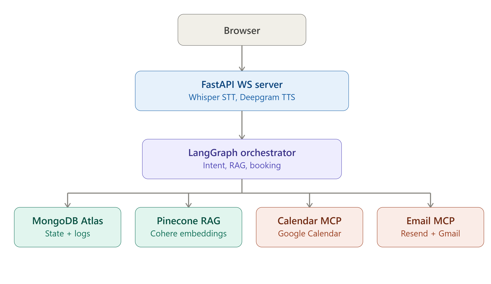
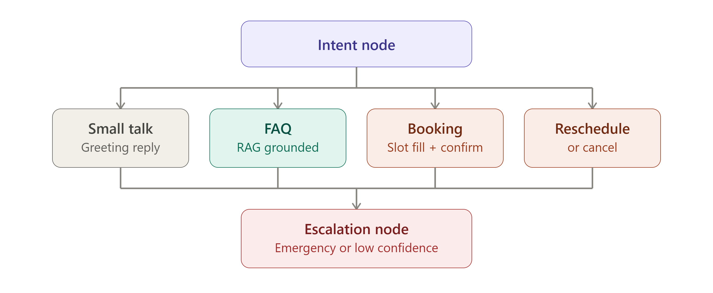
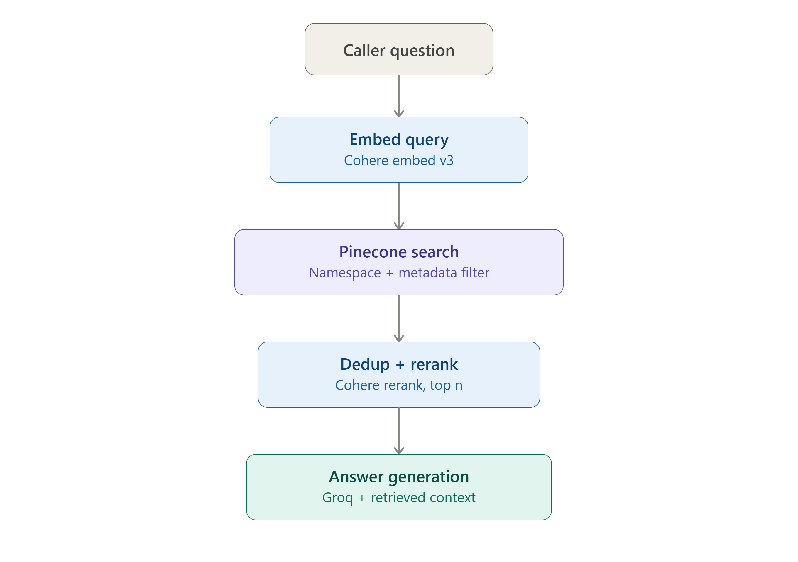

# BrightPath Clinic — Voice Receptionist

An AI voice receptionist for a medical clinic. Callers speak into a browser widget; the system transcribes, understands intent, answers questions from a knowledge base, books/reschedules/cancels appointments on a real calendar, and speaks the reply back — all through a stateful LangGraph conversation engine with a MongoDB-backed memory and a staff-facing admin dashboard.

<p>
  
  
  
  
  
  
</p>

---

## Table of contents

- [Overview](#overview)
- [Core capabilities](#core-capabilities)
- [System architecture](#system-architecture)
- [Conversation routing](#conversation-routing)
- [Knowledge base retrieval (RAG)](#knowledge-base-retrieval-rag)
- [Conversation flows](#conversation-flows)
- [Tech stack](#tech-stack)
- [Project structure](#project-structure)
- [Getting started](#getting-started)
- [Environment variables](#environment-variables)
- [WebSocket protocol](#websocket-protocol)
- [Admin dashboard](#admin-dashboard)
- [Data model](#data-model)
- [Scripts and testing](#scripts-and-testing)
- [Design notes](#design-notes)

---

## Overview

The project is split into two applications that share one purpose:

| Part | Location | Responsibility |
|---|---|---|
| **Backend** | `app/`, `main.py` | FastAPI service exposing a voice WebSocket and an admin REST API. Runs speech-to-text, a LangGraph conversation graph, RAG-grounded FAQ answers, calendar booking, email notifications, and text-to-speech. |
| **Frontend** | `frontend/` | Next.js marketing site, an interactive voice demo widget, and a password-protected admin dashboard for clinic staff. |

Every call is a **thread**: a `call_sid` generated per WebSocket connection is used as the LangGraph checkpoint thread ID, so conversation state (booking progress, reschedule lookups, transcript) persists in MongoDB across turns without the client ever managing state itself.

## Core capabilities

- **Voice in, voice out** — browser microphone audio is transcribed with Groq-hosted Whisper and replies are synthesized with Deepgram Aura-2, streamed back over the same WebSocket.
- **Intent-routed conversation** — a LangGraph state machine classifies every message and routes it to the right specialist node, while safety checks (medical emergencies, low-confidence input) always take priority.
- **Grounded FAQ answers** — clinic policy questions are answered strictly from an ingested PDF knowledge base via embedding search, reranking, and category-aware fallback, never from the model's own knowledge.
- **Multi-turn appointment booking** — collects patient details across turns, validates each field, checks real business hours and calendar availability, confirms a summary back to the caller, and only then books.
- **Reschedule / cancel by booking ID** — looks an appointment up by a spoken booking ID, reads it back for confirmation, and mutates the real calendar event.
- **Tool access via MCP** — calendar and email operations are exposed as Model Context Protocol tool servers rather than called as plain Python functions, decoupling the graph from the transport used to reach them.
- **Escalation and safety net** — emergency language, low-confidence classification, repeated failed attempts, or explicit staff requests all fall through to a consistent escalation path that is logged for follow-up.
- **Persistent memory** — MongoDB-backed LangGraph checkpointing keeps each call's state alive for the life of the process; patients, appointments, and escalations are additionally logged to their own collections for reporting.
- **Admin dashboard** — a cookie/JWT-protected staff view of booking stats, appointments, patients, and escalations.

## System architecture

<p align="center">
  
</p>

The browser talks to a single FastAPI WebSocket endpoint (`/ws/voice`), which performs speech-to-text and text-to-speech around a call into the LangGraph orchestrator. The orchestrator is the only component that touches external systems:

- **MongoDB Atlas** — LangGraph checkpoints (conversation state) plus `patients`, `appointments`, and `escalations` collections.
- **Pinecone** — vector index of the clinic's FAQ knowledge base, embedded with Cohere.
- **Calendar MCP server** — a stdio MCP subprocess wrapping the Google Calendar API (availability, booking, reschedule, cancel).
- **Email MCP server** — a stdio MCP subprocess wrapping Resend (staff notifications) and Gmail SMTP (patient confirmations).

## Conversation routing

<p align="center">
  
</p>

Every turn starts at the **intent node**, which classifies the caller's message with a structured-output LLM call (category, emergency flag, confidence — always evaluated independently so an emergency is never missed just because the category looks routine). Routing then applies, in priority order:

1. An in-progress **booking** or **reschedule/cancel** flow always keeps control of the turn, regardless of what this message looks like — a caller mid-booking who mentions something else doesn't get bounced out of the flow.
2. A detected **medical emergency** always routes to escalation, independent of category.
3. Otherwise the classified category sends the turn to **FAQ**, **booking**, **reschedule/cancel**, or **small talk**; unclear or low-confidence input also escalates rather than guessing.

`faq_node` can itself hand off to escalation if retrieval confidence is too low to answer honestly.

## Knowledge base retrieval (RAG)

<p align="center">
  
</p>

FAQ answers are always grounded in the clinic's own documents — the model is instructed to answer only from retrieved context and never to invent clinic facts:

1. The caller's question is embedded with Cohere `embed-english-v3.0`.
2. Pinecone is searched inside the clinic's namespace, filtered to the classified FAQ category (`active: true` metadata only).
3. Candidates are deduplicated and reranked with Cohere `rerank-english-v3.0`; if the top score is below a confidence threshold, the search is retried without the category filter as a fallback.
4. If nothing clears the confidence bar even after fallback, the turn is escalated instead of answered — a low-confidence guess is never spoken to the caller.
5. Otherwise, the top reranked passages are passed as context to Groq (`llama-3.3-70b-versatile`) for a short, spoken-style answer.

Source documents live in `data/kb/` as PDFs (hours, appointments, cancellation policy, insurance/billing, new patient), one Pinecone namespace per business, chunked per Q&A section (falling back to word-window chunking for documents without clear Q&A headings).

## Conversation flows

**Booking a new appointment** (`booking_node`) — collects name, age, email, reason for visit, and preferred date/time across as many turns as needed, re-asking only for missing or invalid fields; reads a full summary back for confirmation before touching the calendar; parses natural language dates (dateparser, always anchored to the current moment); rejects past dates, out-of-hours slots, and slots that just became unavailable; generates a `BP######` booking ID; logs the booking, notifies clinic staff by email, and sends the patient a confirmation. Callers can abandon the flow at any point ("never mind", "forget it") and it's detected both by the LLM extraction and a deterministic keyword fallback.

**Reschedule / cancel** (`reschedule_cancel_node`) — looks an appointment up by spoken booking ID (normalized from spelled-out letters/digits), reads the found appointment back for confirmation, then either cancels it or collects and validates a new slot the same way booking does. If the caller goes off-topic mid-lookup, the node can answer a quick FAQ inline before returning to the ID prompt.

**Escalation** (`escalation_node`) — a single consistent hand-off message (a distinct one for medical emergencies), always logged to the `escalations` collection with the triggering category and message for staff follow-up.

**Small talk** (`small_talk_node`) — a short, warm acknowledgement that deliberately never states clinic facts, redirecting the caller toward their actual request.

## Tech stack

| Layer | Technology |
|---|---|
| Backend framework | FastAPI, Uvicorn, WebSockets |
| Conversation orchestration | LangGraph, `langgraph-checkpoint-mongodb` |
| LLMs | Groq (`llama-3.1-8b-instant` for extraction/classification, `llama-3.3-70b-versatile` for answers), Instructor for structured output |
| Speech-to-text | Groq-hosted Whisper (`whisper-large-v3-turbo`) |
| Text-to-speech | Deepgram Aura-2 |
| Retrieval | Pinecone (vector search), Cohere (`embed-english-v3.0`, `rerank-english-v3.0`) |
| Tool access | Model Context Protocol (`mcp`, `langchain-mcp-adapters`) over stdio |
| Calendar | Google Calendar API (service account) |
| Email | Resend (staff notifications), Gmail SMTP (patient confirmations) |
| Persistence | MongoDB Atlas (conversation checkpoints, patients, appointments, escalations) |
| Auth | JWT-signed admin session cookie |
| Frontend | Next.js 16, React 19, Tailwind CSS 4, lucide-react |
| Tooling | `uv` / `pyproject.toml`, `ngrok` for tunneling |

## Project structure

```
voice-receptionist/
├── app/
│   ├── config.py               # env config, API clients, Pinecone index bootstrap
│   ├── db/mongo.py             # MongoDB collections
│   ├── graph/
│   │   ├── state.py            # ReceptionistState (LangGraph shared state)
│   │   ├── graph_builder.py    # node wiring + MongoDB checkpointer
│   │   ├── edges.py            # routing logic
│   │   └── nodes/              # greeting, intent, faq, booking, reschedule/cancel,
│   │                            #   small talk, escalation, end call, validators, llm_utils
│   ├── mcp/                    # MCP client + calendar/email tool wrappers used by nodes
│   ├── mcp_servers/            # stdio MCP servers (calendar, email)
│   ├── rag/                    # chunking, ingestion, retrieval
│   ├── routes/                 # ws_voice (voice WebSocket), admin (REST API)
│   └── services/                # STT, TTS, calendar, email, patient/appointment logging
├── data/kb/                    # source FAQ PDFs ingested into Pinecone
├── pipelines/                  # architecture diagrams (this README)
├── scripts/                    # ingestion + manual/integration test scripts
├── frontend/                   # Next.js app (marketing site, demo widget, admin dashboard)
├── main.py                     # FastAPI app entrypoint
└── pyproject.toml
```

## Getting started

### Prerequisites

- Python 3.14+ and [`uv`](https://docs.astral.sh/uv/)
- Node.js 20+ and npm
- A MongoDB Atlas cluster
- API keys for Pinecone, Cohere, Groq, and Deepgram
- A Google Cloud service account with Calendar API access, sharing the target calendar
- (Optional, for outbound email) a Resend API key and/or Gmail account with an app password

### Backend

```bash
# Install dependencies
uv sync

# Configure environment (see table below)
cp .env.example .env   # or create .env manually
# place the Google service account JSON at credentials/service_account.json

# Ingest the knowledge base into Pinecone
uv run python scripts/run_ingest.py

# Run the API
uv run uvicorn main:app --reload --port 8000
```

The WebSocket endpoint is available at `ws://localhost:8000/ws/voice`; the admin API is mounted at `/admin/api`.

### Frontend

```bash
cd frontend
npm install
npm run dev
```

The app runs at `http://localhost:3000`. The backend's CORS policy is currently scoped to this origin.

## Environment variables

Set these in `voice-receptionist/.env` (already git-ignored). Required variables raise on startup if missing; optional ones degrade gracefully (skipped with a log line).

| Variable | Required | Purpose |
|---|---|---|
| `PINECONE_API_KEY` | Yes | Vector index for FAQ retrieval |
| `PINECONE_INDEX_NAME` | No | Defaults to `brightpath-clinic-kb` |
| `COHERE_API_KEY` | Yes | Embeddings and reranking |
| `GROQ_API_KEY` | Yes | LLM classification/extraction/generation and Whisper STT |
| `DEEPGRAM_API_KEY` | Yes | Text-to-speech |
| `DEEPGRAM_TTS_MODEL` | No | Defaults to `aura-2-thalia-en` |
| `MONGODB_URI` | Yes | Conversation checkpoints, patients, appointments, escalations |
| `GOOGLE_SERVICE_ACCOUNT_FILE` | Yes | Path to the Calendar service account JSON |
| `GOOGLE_CALENDAR_ID` | Yes | Target calendar for availability/booking |
| `CLINIC_TIMEZONE` | No | Defaults to `America/New_York` |
| `RESEND_API_KEY` | No | Staff booking/reschedule/cancellation notifications |
| `CLINIC_NOTIFICATION_EMAIL_1` / `_2` | No | Recipients for staff notifications |
| `GMAIL_SMTP_USER` / `GMAIL_SMTP_APP_PASSWORD` | No | Patient-facing confirmation emails |
| `TEST_PATIENT_EMAIL_1` / `_2` | No | Whitelist — patient emails only actually go out to these while in test mode |
| `ADMIN_PASSWORD` | Yes (for admin) | Admin dashboard login |
| `ADMIN_JWT_SECRET` | Yes (for admin) | Signs the admin session cookie |

## WebSocket protocol

`/ws/voice` is a lightweight text/binary framed protocol driven by the client:

| Direction | Message | Meaning |
|---|---|---|
| Server → Client | `TRANSCRIPT_ASSISTANT:<text>` | Assistant's spoken reply, as text |
| Server → Client | binary frame | MP3 audio of the assistant's reply |
| Server → Client | `TRANSCRIPT_USER:<text>` | STT transcript of the caller's last turn |
| Server → Client | `ERROR:<message>` | Non-fatal processing error, safe to retry |
| Client → Server | binary frames | Chunks of recorded audio (`webm`/`opus`) |
| Client → Server | `RESET` | Clear the server-side audio buffer before a new recording |
| Client → Server | `END` | Finalize the buffered audio and run STT → graph → TTS |

On connect, the server immediately greets the caller and streams the greeting as both text and audio before any input is required.

## Admin dashboard

A password-gated dashboard (`frontend/app/admin`) backed by `/admin/api/*`:

- `POST /admin/api/login` / `logout` / `GET check` — cookie-based session, HTTP-only, 24-hour JWT
- `GET /admin/api/stats` — total/upcoming/cancelled bookings, cancellation rate, weekly escalations, patient count
- `GET /admin/api/appointments` — booking history
- `GET /admin/api/patients` — patient records with visit counts
- `GET /admin/api/escalations` — logged escalations with category and triggering message

## Data model

MongoDB database `voice_receptionist`:

| Collection | Contents |
|---|---|
| `checkpoints` (LangGraph-managed) | Per-call conversation state, keyed by `call_sid` as the thread ID |
| `patients` | Upserted by email; tracks name, age, first/last seen, total bookings |
| `appointments` | Booking ID, patient info, status (`booked`/`rescheduled`/`cancelled`), scheduled time, and a full history of state changes |
| `escalations` | Call ID, reason (`emergency`/`general`), category, triggering message, timestamp |

Appointments themselves are the source of truth in Google Calendar; MongoDB mirrors them for reporting and lookup history.

## Scripts and testing

`scripts/` contains ingestion and end-to-end test utilities run with `uv run python scripts/<name>.py`, covering: knowledge base ingestion (`run_ingest.py`), interactive chat testing (`run_chat.py`), retrieval quality, calendar and email integrations (direct and via MCP), the full booking/reschedule/cancel happy paths and their edge cases (validation, past dates, repeated cancellation, confirmation fallback wording), MongoDB persistence, and checkpoint debugging.

## Design notes

- The LangGraph MongoDB checkpointer is opened once at import time and deliberately never closed, keeping one long-lived connection for the process instead of reconnecting per call.
- `receptionist_graph.invoke(...)` is synchronous and makes blocking network calls; the WebSocket handler runs it via `asyncio.to_thread` so one slow call never blocks other connected callers.
- Calendar API calls retry with backoff on transient network errors and 5xx responses, since a flaky call mid-booking should not silently fail a real appointment.
- Patient-facing emails are gated behind an explicit test-email whitelist; clinic-facing notifications are not, since they go to trusted staff addresses.
